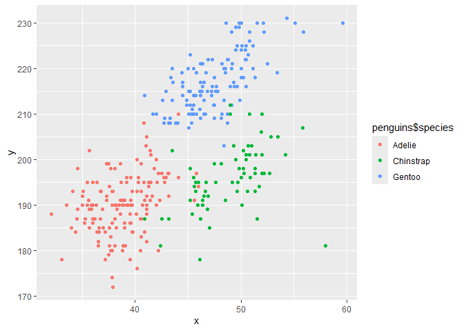

Homework 1
================
luyao mao
2026-09-26

## Library

``` r
library("tidyverse")
```

    ## ── Attaching core tidyverse packages ──────────────────────── tidyverse 2.0.0 ──
    ## ✔ dplyr     1.2.1     ✔ readr     2.2.0
    ## ✔ forcats   1.0.1     ✔ stringr   1.6.0
    ## ✔ ggplot2   4.0.3     ✔ tibble    3.3.1
    ## ✔ lubridate 1.9.5     ✔ tidyr     1.3.2
    ## ✔ purrr     1.2.2     
    ## ── Conflicts ────────────────────────────────────────── tidyverse_conflicts() ──
    ## ✖ dplyr::filter() masks stats::filter()
    ## ✖ dplyr::lag()    masks stats::lag()
    ## ℹ Use the conflicted package (<http://conflicted.r-lib.org/>) to force all conflicts to become errors

## Problem 1

``` r
data("penguins", package = "palmerpenguins")
```

The penguins dataset has information about different penguins, with
variables including species, island, bill_length_mm, bill_depth_mm,
flipper_length_mm, body_mass_g, sex, year. The three species are Adelie,
Chinstrap, Gentoo and the penguins are from Biscoe, Dream, Torgersen
islands.

The size of this dataset are 344 observations and 8 variables.

The mean of flipper length is 200.92.

``` r
plot_df = 
  tibble( x = penguins$bill_length_mm, 
          y = penguins$flipper_length_mm )

ggplot( plot_df, 
        aes( x = x, y = y, color = penguins$species )) + geom_point()
```

<!-- -->

``` r
ggsave( filename = "penguins_scatterplot.png" )
```

    ## Saving 7 x 5 in image

## Problem 2

### Create a dataframe

``` r
set.seed(1)

problem2_df = 
  tibble( num_var = rnorm(10),
          log_var = num_var > 0,
          cha_var = letters[1:10],
          fac_var = factor( rep(c("A", "B", "C"), length.out = 10 ))
  )

problem2_df
```

    ## # A tibble: 10 × 4
    ##    num_var log_var cha_var fac_var
    ##      <dbl> <lgl>   <chr>   <fct>  
    ##  1  -0.626 FALSE   a       A      
    ##  2   0.184 TRUE    b       B      
    ##  3  -0.836 FALSE   c       C      
    ##  4   1.60  TRUE    d       A      
    ##  5   0.330 TRUE    e       B      
    ##  6  -0.820 FALSE   f       C      
    ##  7   0.487 TRUE    g       A      
    ##  8   0.738 TRUE    h       B      
    ##  9   0.576 TRUE    i       C      
    ## 10  -0.305 FALSE   j       A

### Take the mean of each variable

``` r
mean(pull(problem2_df, num_var))
```

    ## [1] 0.1322028

``` r
mean(pull(problem2_df, log_var))
```

    ## [1] 0.6

``` r
mean(pull(problem2_df, cha_var))
```

    ## Warning in mean.default(pull(problem2_df, cha_var)): argument is not numeric or
    ## logical: returning NA

    ## [1] NA

``` r
mean(pull(problem2_df, fac_var))
```

    ## Warning in mean.default(pull(problem2_df, fac_var)): argument is not numeric or
    ## logical: returning NA

    ## [1] NA

The mean works for the numeric and logical variables. It does not work
for the character and factor variables. R returns `NA` because these
variables are not numeric or logical.

### Convert variables from one type to another

``` r
as.numeric(pull(problem2_df, log_var))
as.numeric(pull(problem2_df, cha_var))
as.numeric(pull(problem2_df, fac_var))
```

After using `as.numeric`, the logical variable changes to 0 and 1
because R treats `FALSE` as 0 and `TRUE` as 1. The character variable
changes to `NA` because letters cannot be converted to numbers. The
factor variable changes to 1, 2, and 3. These numbers are the internal
codes for the three factor levels, not actual numerical measurements.
This explains why the mean works for the logical variable. Its mean is
the proportion of `TRUE` values. The mean does not work for the
character variable because its values are not numbers. The factor
variable represents categories, so taking the mean of its level codes is
not meaningful.
